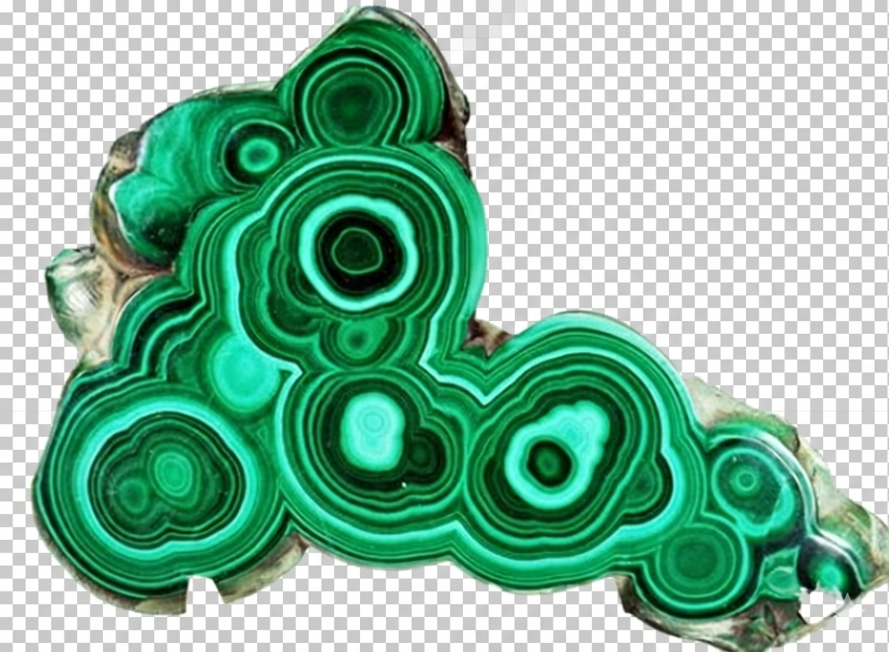

# Malachite Substrate 🟢
### The Causal Ontology of Civilization
<p align="center">
  
</p>
---
## 🌐 Live Interactive Exploration

Explore the causal "Crystal of Civilization" directly in your browser. No installation required:

# [🚀 ENTER THE MALACHITE VISUALIZATION](https://anton-art.github.io/malachite-substrate/)

> *Click on nodes to see "Eureka" moments, physical principles, and technological dependencies.*
---
<p align="center">
  <a href="https://creativecommons.org/licenses/by/4.0/"></a>
  <a href="https://github.com/Anton-art/malachite-substrate/actions"></a>
  <a href="https://www.python.org/"></a>
</p>

> *"Current AI models are gas: volatile, expansive, and amnesic. To build true AGI, we need a solid state. We need Malachite."*

**Malachite Substrate** is the **External Causal Memory** for AI Agents. It maps the evolution of humanity not as a list of dates, but as a directed acyclic graph (DAG) of **Observations, Eurekas, and Tools**.

It serves as a "Ground Truth" anchor to prevent hallucinations and enable causal reasoning in Large Language Models.  

---

## 💎 The Philosophy: The Evolution of Reason

We structure the database into **3 Logic Eras**, reflecting how Intelligence interacts with the Universe:

1.  **Intuitive Era (The Hand):**
    *   *Logic:* Observation + Surprise = **Idea** → Tool.
    *   *Example:* Fire, The Wheel, Lever.
2.  **Scientific Era (The Eye):**
    *   *Logic:* Idea + Proof = **Law** (Abstract Tool).
    *   *Example:* Thermodynamics, Electromagnetism, Germ Theory.
3.  **Syntropy Era (The Mind):**
    *   *Logic:* Invention + Social Simulation = **Harmonious Future**.
    *   *Example:* AI Alignment, Sustainable Energy, DAO.

---

## 🏗️ Architecture

The repository consists of two parts:
1.  **The Substrate (`data/`)**: Immutable CSV ledgers of history, physics, and digital evolution.
2.  **The Engine (`malachite/`)**: Python SDK to traverse the graph, validate causality, and visualize the crystal.

### Data Layers
*   **FOUNDATIONS:** Earth, Water, Sky (The Environment).
*   **CRYSTALLIZED:** Verified History (Hard Constraints). Includes *Primitive*, *Scientific*, *Electric*, and *Digital* eras.
*   **HYPOTHESIS:** Latent space for AI exploration (Future).
*   **SIMULATION:** "Package Deals" (Tech + Law) waiting for deployment.

---

## 🛠️ Quick Start

### 1. Installation
Clone the repository and install the dependencies (including the `pyvis` visualization engine).

```bash
git clone https://github.com/Anton-art/malachite-substrate.git
cd malachite-substrate
pip install -r requirements.txt
```

### 2. Visualize the Crystal 
Generate an interactive 3D-like graph of civilization in your browser.

```bash
python tools/visualize.py
```
*Output: Opens `malachite_graph.html`. You can zoom, drag nodes, and explore the causal chains from the Stone Age to the AI Age.*

### 3. Validate Integrity (The Sheriff)
Ensure the causal chain is unbroken (no time loops, no orphan technologies).

```bash
python tools/validate.py
```

---

## 📊 Data Schema

We use a strict CSV schema to ensure machine readability.

| Column | Description | Example |
| :--- | :--- | :--- |
| **ID** | Unique Identifier | `DIG-42` |
| **Name** | Human-readable name | `NEURAL_NETWORK` |
| **Type** | Entity category | `METHOD` |
| **Era** | Logic Era | `DIGITAL` |
| **Parents** | Causal dependencies | `[SCI-14;DIG-06;SCI-05]` |
| **Trigger** | The "Eureka" moment | `Software mimicking brain neurons` |

---

## 🤖 Advanced: Neuro-Symbolic Integration

Malachite is designed to be the bridge between **Connectionist AI** (DeepMind/LLMs) and **Symbolic AI** (OpenCog).
*   **LLMs** use it for context and grounding.
*   **Symbolic Engines** use it for logical validation.

*(See `docs/` for integration patterns - coming soon)*

## 🤝 Contribution

We are reconstructing the causal chain of humanity.
See [CONTRIBUTING.md](CONTRIBUTING.md) for the **Genesis Protocol**.

**License:** CC-BY-4.0 (Open Knowledge for a Post-Information Civilization).
